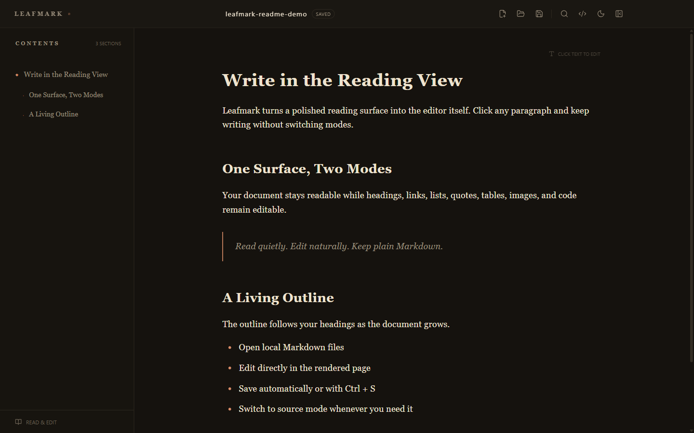
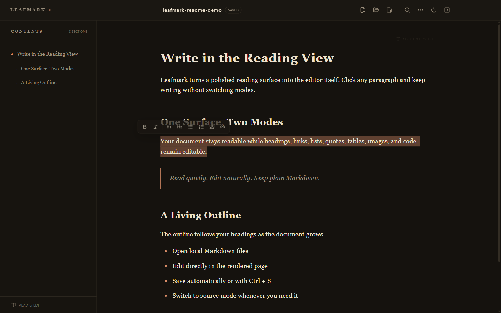
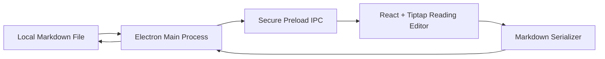

<div align="center">
  
  <h1>Leafmark</h1>
  <p><strong>Edit Markdown where you read it.</strong><br><strong>在阅读界面中直接编辑 Markdown。</strong></p>
  <p>
    
    
    
    
  </p>
</div>

Leafmark is an immersive Markdown reader and editor for Windows. It turns the rendered reading view into the editor itself: open a Markdown file, click the formatted page, and start writing without moving back and forth between an editor and a preview.

Leafmark 是一款面向 Windows 的沉浸式 Markdown 阅读与编辑器。它把渲染后的阅读页面直接变成编辑器：打开 Markdown 文件，单击排版后的正文即可书写，不必在编辑器和预览窗口之间反复切换。

## Preview · 界面预览

**A calm reading surface with a live document outline.** 具有实时目录的沉浸式阅读界面。



**Select text to reveal the inline formatting toolbar.** 选中文字后显示浮动格式工具栏。



> The demo document inside the screenshots is intentionally written in English so the visual guide is accessible internationally. 以上截图中的演示文档特意使用英文，方便不同语言的用户理解。

## Highlights · 核心功能

| Feature · 功能 | Description · 说明 |
| --- | --- |
| **Edit in the reading view**<br>阅读即编辑 | Click the rendered page and write directly.<br>单击排版后的正文即可直接书写。 |
| **Markdown round trip**<br>Markdown 双向转换 | Parse Markdown into a structured document and serialize it back to plain Markdown.<br>在结构化文档和标准 Markdown 之间双向转换。 |
| **Live outline**<br>实时目录 | Build a navigable outline from headings as the document changes.<br>根据标题实时生成可跳转的文章目录。 |
| **Inline formatting**<br>选区格式化 | Format selected text with headings, bold, italic, quotes, lists, and links.<br>通过浮动工具栏设置标题、粗体、斜体、引用、列表和链接。 |
| **Source mode**<br>源码模式 | Switch to the original Markdown source whenever precise control is needed.<br>需要精确控制时可随时切换到原始 Markdown。 |
| **Local file workflow**<br>本地文件工作流 | Create, open, drag, save, save as, and associate Markdown files.<br>支持新建、打开、拖放、保存、另存为和文件关联。 |
| **Safe auto-save**<br>安全自动保存 | Show save state, reload external changes, and protect unsaved local edits from conflicts.<br>显示保存状态、同步外部变更，并保护未保存内容。 |
| **Three themes**<br>三套主题 | Choose Ink, Paper, or Light to match the reading environment.<br>提供墨夜、纸张和明亮三种主题。 |

Supported content includes headings, paragraphs, bold, italic, blockquotes, ordered and unordered lists, links, images, tables, inline code, and code blocks.

支持标题、段落、粗体、斜体、引用、有序与无序列表、链接、图片、表格、行内代码和代码块。

## How it works · 工作方式

1. **Reading is editing** — click the formatted document and type.<br>
   **阅读即编辑**——单击排版后的文档直接输入。
2. **Selection formatting** — select text to open the floating toolbar.<br>
   **选区格式化**——选中文字后使用浮动工具栏设置格式。
3. **Markdown source** — press `Ctrl+/` to edit the original source.<br>
   **Markdown 源码**——按下 `Ctrl+/` 编辑原始内容。



The Electron main process owns trusted file operations. The React renderer runs with `contextIsolation` and sandboxing enabled, and receives only a minimal file API through preload IPC.

Electron 主进程负责可信文件操作。React 渲染进程启用 `contextIsolation` 和沙箱，只能通过最小化的 preload IPC 接口访问文件能力。

## Technology · 技术栈

- **Electron** — desktop windows, native dialogs, and local files · 桌面窗口、原生对话框与本地文件
- **React + TypeScript** — interface and document state · 界面与文档状态
- **Tiptap / ProseMirror** — structured rich-text editing · 结构化富文本编辑
- **@tiptap/markdown** — Markdown parsing and serialization · Markdown 解析与序列化
- **Vite / electron-vite** — development and production builds · 开发与生产构建
- **electron-builder** — Windows NSIS installer · Windows NSIS 安装包

## Project structure · 项目结构

```text
leafmark/
├─ build/                    # Application icons · 应用图标
├─ docs/images/              # README visuals · 说明文档图片
├─ src/
│  ├─ main/                  # Electron main process · Electron 主进程
│  ├─ preload/               # Secure IPC bridge · 安全 IPC 桥接
│  ├─ renderer/              # React/Tiptap interface · 编辑界面
│  │  ├─ lib/                # Outline and document state · 目录与文档状态
│  │  └─ styles/             # Reading themes and layout · 阅读主题与排版
│  └─ shared.ts              # Shared process types · 进程共享类型
├─ electron.vite.config.ts
├─ package.json
├─ package-lock.json
└─ tsconfig.json
```

## Requirements · 环境要求

- Windows 10 or Windows 11 · Windows 10 或 Windows 11
- Node.js 20 or later · Node.js 20 或更高版本
- npm 10 or later · npm 10 或更高版本

## Quick start · 快速开始

```powershell
git clone https://github.com/957115488-dotcom/leafmark.git
cd leafmark
npm ci
npm run dev
```

If you use GitHub's **Download ZIP**, extract it and run `npm ci` followed by `npm run dev` inside the project directory.

如果通过 GitHub 的 **Download ZIP** 下载，请解压后进入项目目录，依次执行 `npm ci` 和 `npm run dev`。

## Build · 构建

Type-check and create a production build · 类型检查并创建生产构建：

```powershell
npm run typecheck
npm run build
```

Create the Windows installer · 生成 Windows 安装包：

```powershell
npm run dist
```

The installer is written to `dist/`. Generated dependencies, build output, and installers are excluded from Git.

安装包输出到 `dist/`。依赖、构建产物和安装程序不会提交到 Git 仓库。

## Shortcuts · 快捷键

| Shortcut · 快捷键 | Action · 功能 |
| --- | --- |
| `Ctrl+N` | New document · 新建文稿 |
| `Ctrl+O` | Open Markdown · 打开 Markdown |
| `Ctrl+S` | Save · 保存 |
| `Ctrl+Shift+S` | Save as · 另存为 |
| `Ctrl+F` | Find · 查找内容 |
| `Ctrl+/` | Toggle reading editor and source mode · 切换阅读编辑与源码模式 |
| `Ctrl+Z` | Undo · 撤销 |
| `Ctrl+Shift+Z` | Redo · 重做 |

## Files and privacy · 文件与隐私

Leafmark reads and writes local Markdown files directly. It requires no account and does not upload documents to a remote service. Recent files, window state, and theme preferences remain in the local application data directory.

Leafmark 直接读写本地 Markdown 文件，不要求注册账号，也不会把文稿上传到远程服务。最近文件、窗口状态和主题偏好仅保存在本机应用数据目录中。

## Version · 当前版本

`0.1.0`
